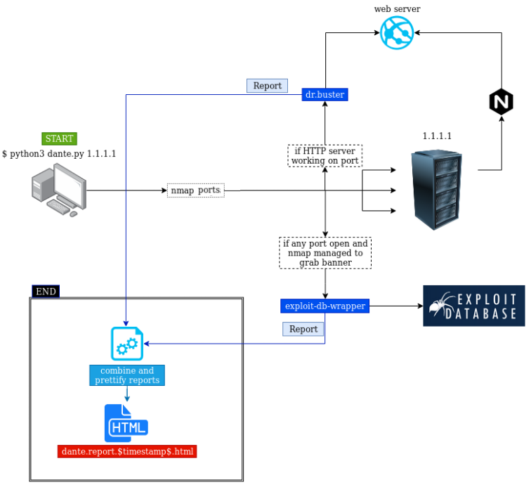

# dante

#### Workflow



```
dante uses
    * exploit-db-wrapper (https://github.com/kelj0/exploit-db-wrapper)
    * dr.buster (https://github.com/kelj0/dr.buster)
    * python-nmap (https://xael.org/pages/python-nmap-en.html)
    * <insert python pdf library>
```

